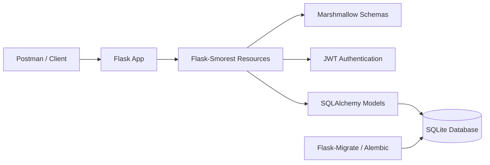

# REST API with Python, Flask, Docker, Postman & SQLAlchemy

A REST API built with Flask for managing stores, items, tags, and users.  
The project includes authentication, database models, migrations, request validation, and Docker support.

## Stack

- Python
- Flask
- Flask-Smorest
- SQLAlchemy / Flask-SQLAlchemy
- Flask-Migrate / Alembic
- Flask-JWT-Extended
- Marshmallow
- Docker
- Postman

## What The API Does

This API allows users to manage a simple store inventory system.

It supports:

- User registration and login
- JWT access and refresh tokens
- Store creation and retrieval
- Item creation, retrieval, update, and deletion
- Tags for organizing items
- Linking tags to items
- Database persistence with SQLAlchemy
- API documentation through Swagger UI

## Architecture



## Endpoints

| Method | Endpoint | Description |
| --- | --- | --- |
| `POST` | `/register` | Register a new user |
| `POST` | `/login` | Log in and receive JWT tokens |
| `POST` | `/refresh` | Refresh an access token |
| `POST` | `/logout` | Log out and revoke token |
| `GET` | `/user/<user_id>` | Get a user by ID |
| `DELETE` | `/user/<user_id>` | Delete a user |
| `GET` | `/store` | Get all stores |
| `POST` | `/store` | Create a store |
| `GET` | `/store/<store_id>` | Get a store by ID |
| `DELETE` | `/store/<store_id>` | Delete a store |
| `GET` | `/item` | Get all items |
| `POST` | `/item` | Create an item |
| `GET` | `/item/<item_id>` | Get an item by ID |
| `PUT` | `/item/<item_id>` | Update an item |
| `DELETE` | `/item/<item_id>` | Delete an item |
| `GET` | `/store/<store_id>/tag` | Get tags for a store |
| `POST` | `/store/<store_id>/tag` | Create a tag |
| `GET` | `/tag/<tag_id>` | Get a tag by ID |
| `DELETE` | `/tag/<tag_id>` | Delete a tag |
| `POST` | `/item/<item_id>/tag/<tag_id>` | Link a tag to an item |
| `DELETE` | `/item/<item_id>/tag/<tag_id>` | Remove a tag from an item |

Swagger UI is available at:

```bash
http://127.0.0.1:5000/swagger-ui
```

## Run Locally

Clone the repository:

```bash
git clone https://github.com/DragosCP/REST-API-Python.git
cd REST-API-Python
```

Create and activate a virtual environment:

```bash
python -m venv .venv
```

Windows:

```bash
.venv\Scripts\activate
```

macOS/Linux:

```bash
source .venv/bin/activate
```

Install dependencies:

```bash
pip install -r requirements.txt
```

Run database migrations:

```bash
flask db upgrade
```

Start the Flask app:

```bash
flask run
```

The API will be available at:

```bash
http://127.0.0.1:5000
```

## Run With Docker

Build the Docker image:

```bash
docker build -t rest-api-python .
```

Run the container:

```bash
docker run --rm -p 5000:80 rest-api-python
```

## What I Learned

While building this project, I practiced:

- Creating REST APIs with Flask
- Structuring an API with resources, models, and schemas
- Using SQLAlchemy relationships
- Managing database migrations with Flask-Migrate and Alembic
- Adding JWT authentication and refresh tokens
- Hashing user passwords
- Validating request data with Marshmallow
- Testing endpoints with Postman
- Running a Flask API with Docker and Gunicorn
